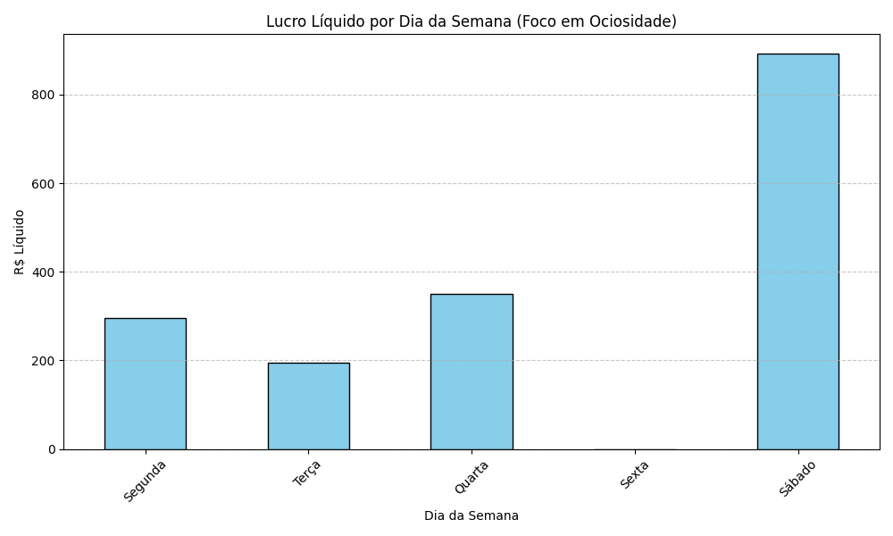

# 📊 Analisando a Lucratividade de uma Barbearia com Python & SQL

Este projeto analisa o faturamento real de uma barbearia, identificando dias de baixa ociosidade e o impacto das taxas de cartão no lucro líquido.

## 🚀 Tecnologias Utilizadas
- **Python**: Lógica principal.
- **Pandas**: Manipulação e tratamento de dados.
- **SQLite**: Armazenamento dos serviços.
- **Matplotlib**: Geração de gráficos de análise.

## 📈 Insights Gerados
Através da análise, identificamos que a **Terça-feira** opera com apenas 25% da capacidade em comparação ao **Sábado**. Além disso, calculamos o lucro real após as taxas de Crédito (4.99%) e Débito (2.0%).

### Visualização dos Dados
